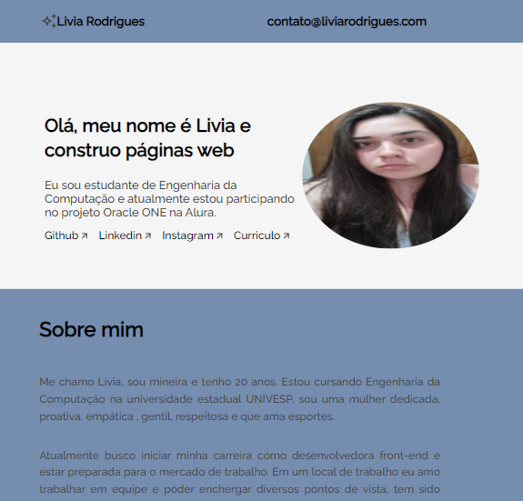

# Challenge ONE | Front End - Portfólio
---

     

### Analisando meu repositório!
---
### Este é o repositório base do meu projeto, nele você encontrará:
#### 🔹index.html: Utilizei as estruturas básicas do html e o método BEM que foi proposto utilizar no projeto .
#### 🔹style.css: no css desenvolvi o designer da interface usando os conceitos dos cursos de flexbox, layouts e arquitetura css.
#### 🔹javascript: No js adicionei a validação dos campos nome, email, assunto , mensagem e botão;

 
